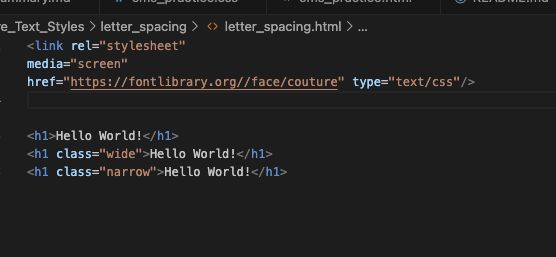
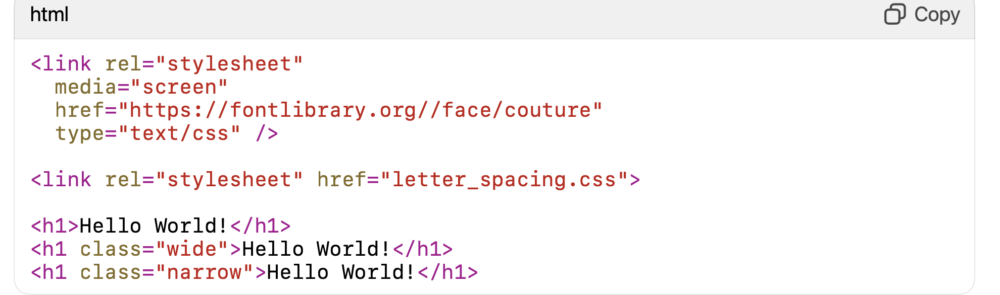

font stack
This is the list of fonts which might be installed on giving browser.
If one of the font in the list is in the giving browser, it will use that font.

body {
  font-family: system-ui, "Segoe UI", Roboto, Helvetica, Arial, sans-serif, "Apple Color Emoji", "Segoe UI Emoji", "Segoe UI Symbol";
}

font liblary
include link to download font to use on the site.
<link rel="preconnect" href="https://fonts.googleapis.com">
<link rel="preconnect" href="https://fonts.gstatic.com" crossorigin>
<link href="https://fonts.googleapis.com/css2?family=Roboto&display=swap" rel="stylesheet">

… or an @import tag that can be dropped at the top of a CSS file.
@import url('https://fonts.googleapis.com/css2?family=Roboto&display=swap');

これではなぜダメか

これのように

<link rel="stylesheet" href="letter_spacing.css">

この１行がない。
これは HTML に「この CSS ファイルを読み込んでください」と命令するタグです。

この1行がないと、
あなたが CSS ファイルに書いたスタイルは 一切ブラウザに届きません。